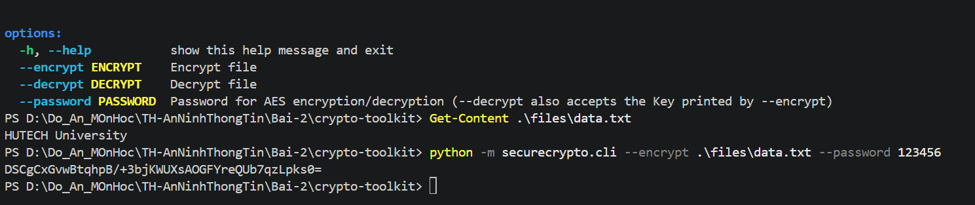
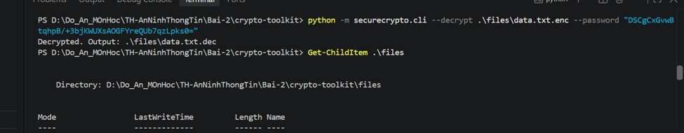
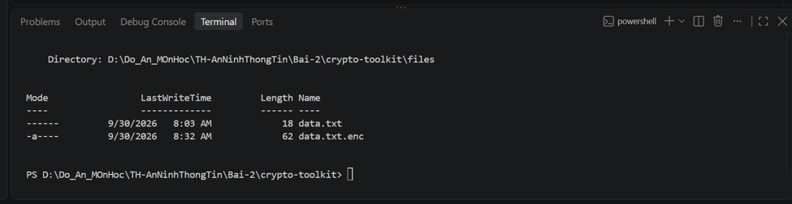
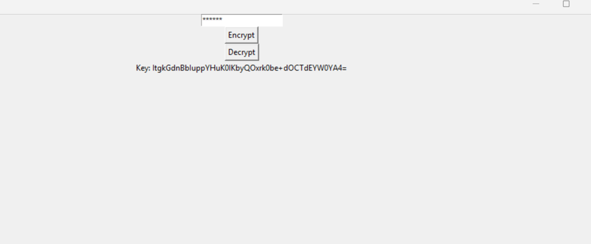
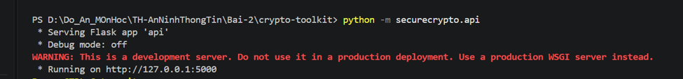
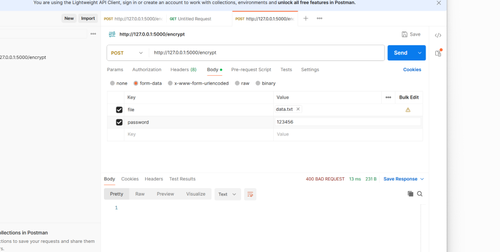
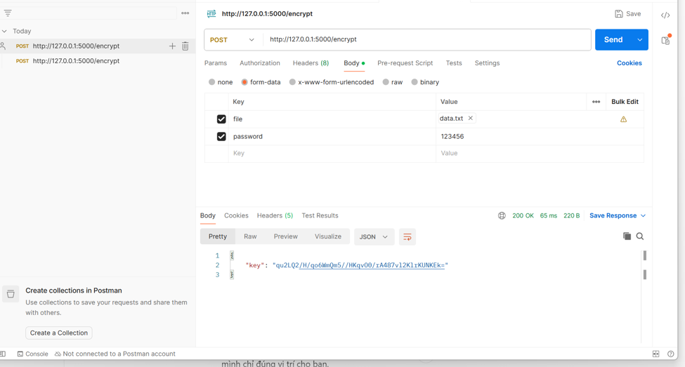

# CryptoToolkit - Thực hành mã hóa

Project thực hành các chức năng mã hóa/giải mã file bằng AES, giao diện GUI và Flask API.

## 1. Mã hóa file bằng CLI

Chạy CLI để mã hóa `data.txt` bằng mật khẩu.

```powershell
python -m securecrypto.cli --encrypt .\files\data.txt --password 123456
```

Kết quả chương trình trả về khóa dùng cho quá trình giải mã.

![Mã hóa file bằng CLI]


## 2. Giải mã file bằng CLI

Sử dụng file `data.txt.enc` và khóa được tạo ở bước mã hóa để giải mã.

```powershell
python -m securecrypto.cli --decrypt .\files\data.txt.enc --password "<KEY>"
```

![Giải mã file bằng CLI]



## 3. GUI mã hóa và giải mã

Khởi chạy giao diện:

```powershell
python -m securecrypto.app_gui
```

GUI cho phép nhập mật khẩu và thực hiện Encrypt/Decrypt trực quan.

![GUI AES]


## 4. Flask API

Khởi chạy Flask API:

```powershell
python -m securecrypto.api
```

Server chạy cục bộ tại `http://127.0.0.1:5000`.

![Flask API đang chạy]


### API Encrypt với Postman

Gửi request:

```text
POST http://127.0.0.1:5000/encrypt
```

Body sử dụng `form-data`:

- `file`: file cần mã hóa, ví dụ `data.txt`
- `password`: mật khẩu dùng để mã hóa

![Thiết lập request trên Postman]


Khi request hợp lệ, API trả về khóa mã hóa trong response JSON.

![Kết quả API Encrypt]


## Kết quả

Các bước thực hành trong tài liệu minh chứng CLI mã hóa/giải mã, GUI AES và Flask API hoạt động trên môi trường local.
