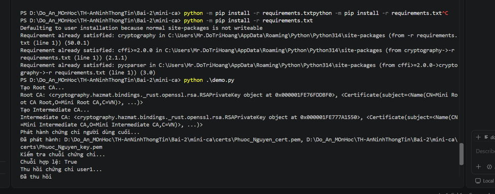
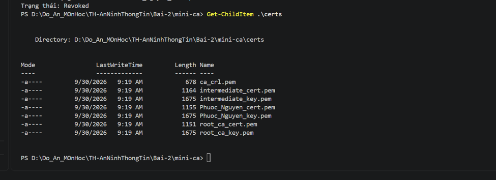
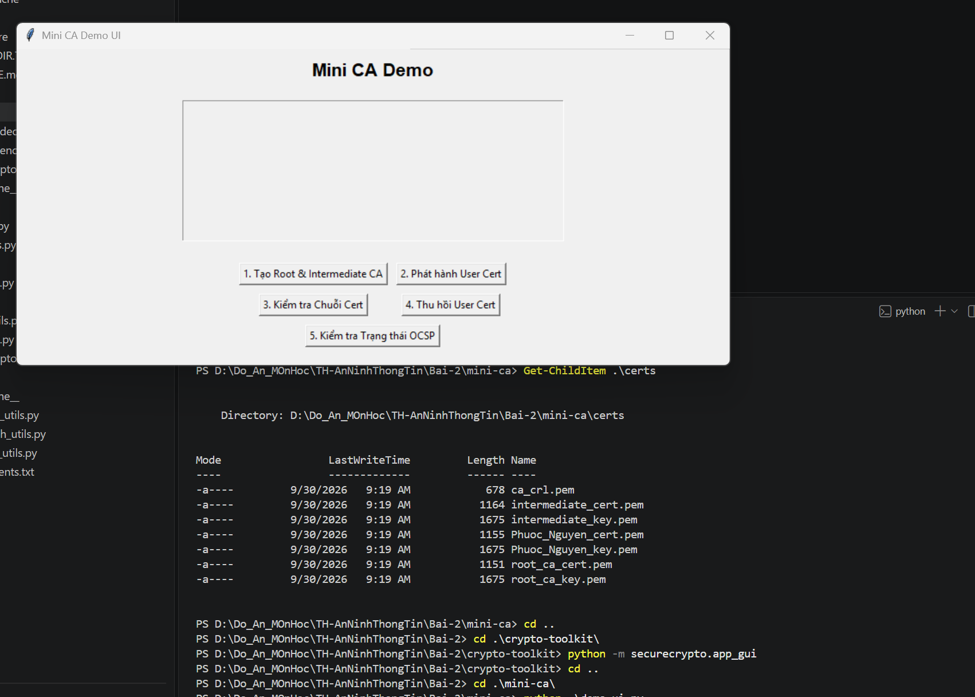

# Mini-CA - Thực hành Certificate Authority

Project mô phỏng một Certificate Authority (CA) thu nhỏ với Root CA, Intermediate CA, chứng chỉ người dùng cuối, xác thực chuỗi chứng chỉ và thu hồi chứng chỉ.

## 1. Chạy Mini-CA Demo

Cài dependency:

```powershell
python -m pip install -r requirements.txt
```

Chạy demo:

```powershell
python .\demo.py
```

Quy trình demo thực hiện:

1. Tạo Root CA.
2. Tạo Intermediate CA.
3. Phát hành chứng chỉ người dùng cuối.
4. Kiểm tra chuỗi chứng chỉ.
5. Thu hồi chứng chỉ.
6. Kiểm tra trạng thái OCSP.

![Kết quả chạy Mini-CA]


## 2. Các chứng chỉ được tạo

Sau khi chạy demo, các file chứng chỉ và khóa được lưu trong thư mục `certs`.

```powershell
Get-ChildItem .\certs
```

Tài liệu minh họa các file như Root CA, Intermediate CA, chứng chỉ người dùng cuối và các private key tương ứng.

![Các file chứng chỉ được tạo]


## 3. GUI Mini-CA

Khởi chạy giao diện:

```powershell
python .\demo_ui.py
```

GUI hỗ trợ các thao tác chính của Mini-CA như tạo Root/Intermediate CA, phát hành chứng chỉ, kiểm tra chuỗi, thu hồi và kiểm tra trạng thái.

![Giao diện Mini-CA]


## 4. Kết quả xác thực và thu hồi

Kết quả trong tài liệu cho thấy:

```text
Chuỗi hợp lệ: True
Đã thu hồi chứng chỉ
Trạng thái OCSP: Đã thu hồi
```

Điều này minh chứng chuỗi chứng chỉ được xác thực thành công trước khi chứng chỉ người dùng được thu hồi và trạng thái sau đó được ghi nhận là đã thu hồi.


## Kết quả

Mini-CA đã thực hiện được quy trình Root CA → Intermediate CA → End-Entity Certificate → Verify Chain → Revoke → kiểm tra trạng thái.
---------------------------------------------------------------------------------------------------------------
Tạo Root CA...
Root CA tạo xong: <cryptography.hazmat.bindings._rust.openssl.rsa.RSAPrivateKey object at 0x000001FCB119B2B0>, <Certificate(subject=<Name(CN=Mini Root CA Root,O=Mini Root CA,C=VN)>, ...)>
Tạo Intermediate CA...
Intermediate CA tạo xong: <cryptography.hazmat.bindings._rust.openssl.rsa.RSAPrivateKey object at 0x000001FCB119B2F0>, <Certificate(subject=<Name(CN=Mini Intermediate CA,O=Mini Intermediate CA,C=VN)>, ...)>
Phát hành chứng chỉ người dùng cuối...
Đã phát hành: D:\Do_An_MOnHoc\TH-AnNinhThongTin\Bai-2\mini-ca\certs\Phuoc_Nguyen_cert.pem, D:\Do_An_MOnHoc\TH-AnNinhThongTin\Bai-2\mini-ca\certs\Phuoc_Nguyen_key.pem
Kiểm tra chuỗi chứng chỉ...
Chuỗi hợp lệ: True
Thu hồi chứng chỉ user...
Đã thu hồi chứng chỉ
Kiểm tra trạng thái OCSP...
Trạng thái OCSP: Đã thu hồi
-------------------------------------------------------------------------------------------------------------------
